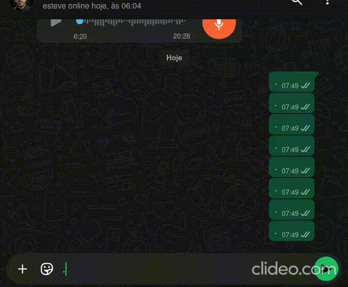
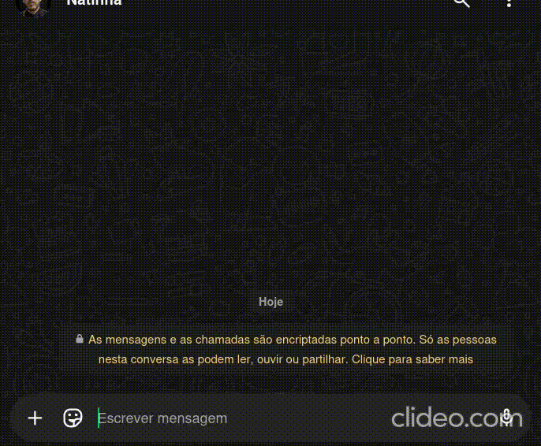

🤖 Chatbot de Suporte com Typebot, GLPI, IA e WhatsApp
📌 Visão Geral

Este projeto é um chatbot inteligente desenvolvido com Typebot, integrado ao GLPI (ITSM - Gestão de Chamados), à OpenAI e ao WhatsApp via API Evolution.

O objetivo é automatizar o atendimento de suporte, permitindo que usuários abram chamados, consultem o andamento e recebam resumos claros gerados por IA — tudo diretamente pelo WhatsApp ou pela interface web.
🚀 Funcionalidades

    ✅ Atendimento automatizado – fluxo inicial guiado para abertura de chamados
    ✅ Integração com GLPI – abertura e consulta de tickets via API REST
    ✅ Consulta de status – acompanhar andamento e comentários de chamados
    ✅ Resumo inteligente com IA (GPT-4.1) – organiza informações de forma clara e cronológica
    ✅ Integração com WhatsApp (API Evolution) – usuários podem interagir direto pelo WhatsApp
    ✅ Escalonamento para atendimento humano – quando necessário
    ✅ Feedback em tempo real – respostas claras e dinâmicas

⚙️ Tecnologias Utilizadas

    Typebot → Criação do fluxo conversacional
    GLPI API REST → Gestão de chamados (abertura e consulta)
    OpenAI GPT-4.1 → Resumo automático de chamados
    API Evolution (WhatsApp) → Envio e recebimento de mensagens no WhatsApp
    Webhooks → Integração entre serviços
    Variáveis de Ambiente (.env) → Segurança das credenciais e tokens

🛠️ Arquitetura do Fluxo

    Usuário inicia atendimento (via web ou WhatsApp)
    O Typebot apresenta opções:
        Abrir chamado
        Consultar andamento
        Falar com humano
    O bot coleta informações (nome, e-mail, matrícula, telefone e descrição do problema)
    Integração com GLPI cria ou consulta o chamado via API
    A IA (GPT-4.1) organiza dados de status e comentários em formato amigável
    O usuário recebe resposta no WhatsApp (via API Evolution) ou na interface web
    Se necessário, o bot redireciona para atendimento humano

🔒 Segurança

As credenciais e tokens não estão incluídos no repositório.
Use variáveis de ambiente para configurá-los:

.env.example

GLPI_USER_TOKEN=seu_token_aqui
GLPI_APP_TOKEN=seu_app_token_aqui
GLPI_SESSION_TOKEN=session_token_aqui
OPENAI_API_KEY=sua_chave_openai_aqui
EVOLUTION_API_KEY=sua_chave_whatsapp
EVOLUTION_INSTANCE=seu_id_da_instancia

📸 Demonstração

## 🎬 Demonstração em Vídeo Cadastrando Ticket (CHAMADO)

## Demonstração em Vídeo Ver Andamento de ticket (CHAMADO)

💡 Diferenciais

🔹 Integração completa entre chatbot, ITSM (GLPI), IA e WhatsApp

🔹 Projeto pensado para redução de tempo de resposta e melhora da experiência do usuário

🔹 Uso de IA generativa para transformar dados técnicos em linguagem clara

🔹 Estrutura segura e escalável, com uso de variáveis de ambiente

🔹 Foco em automação corporativa e atendimento multicanal

